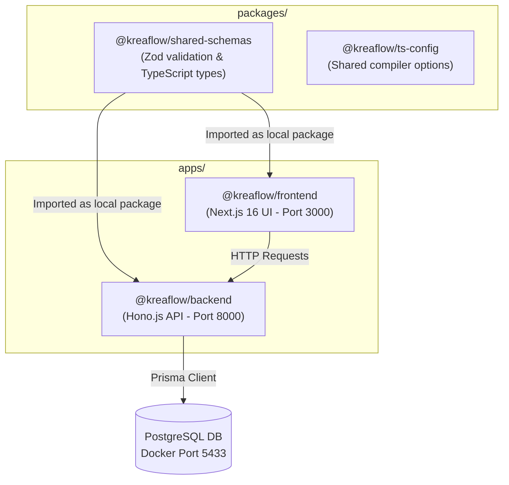

# Kreaflow 🚀

Kreaflow is a high-performance, type-safe, back-office order logging monorepo application. It is designed specifically for Creative Hub to document transactions, dynamic catalog configurations, custom merchandise requirements, and process-optimized summaries for third-party vendors.

---

## 📐 System Architecture

Kreaflow is structured as a monorepo using **pnpm workspaces** and **Turborepo** for optimal caching and parallelized execution.



### Monorepo Workspaces:
1. **`apps/backend`**: Built with **Hono.js** and **Prisma ORM**, using `@hono/zod-openapi` for self-documenting routing (Swagger API docs at `/ui`).
2. **`apps/frontend`**: Built with **Next.js 16 (React 19)**, styled using **Tailwind CSS v4** and **Geist Fonts**, using **Zustand** for state management and **react-hook-form** for dynamic fields.
3. **`packages/shared-schemas`**: The single source of truth for **Zod** models and shared types, ensuring type safety from backend database queries up to frontend UI fields.
4. **`packages/ts-config`**: Shared compiler configuration rules (e.g. NodeNext resolution settings).

---

## ⚙️ Feature Modules & Design Choices

### 1. Master Catalog & Dynamic Attributes
- Products can have a dynamic number of customizable attributes.
- Supported Input Types: `text`, `number`, `option` (multiple choice), or `file` (attachments).
- If a user purchases multiple of the same product within a single order, the UI renders the custom attribute forms **repeatedly and separately** (FR-13) so that individual configurations (e.g. customized names, sizes, or artwork links) do not get mixed up.

### 2. Product Order Summary & Date Aggregation
- Consolidates all individual product purchases and bundle components falling within a specific date range (`order_started_date` to `order_end_date`).
- Upon creation, initial values default to:
  - `fulfillment_type` ➔ `"pesan_vendor"`
  - `fulfillment_status` ➔ `"null"` (displayed as "Belum Diproses" in the UI)
- The date range parameters are locked once generated to enforce operational consistency.

### 3. Vendor-Ready CSV Export Dispatch
- Integrates a flat-mapping pipeline that converts hierarchical transactional records into horizontal tabular spreadsheets.
- **Dynamic Header Mapping**: Automatically injects columns matching the unique attributes defined on the product (e.g., T-Shirts will automatically output custom columns for "Warna Kain", "Ukuran Sablon", etc., while Bags will output "Desain Cetak").
- Escapes contents cleanly to comply with RFC 4180 rules.

---

## 🛠️ Local Development Setup

### Prerequisites
- **Node.js**: `24.x`
- **pnpm**: `>=9.0.0`
- **Docker**: For running PostgreSQL database container.

### Step 1: Clone and Install Dependencies
```bash
pnpm install
```

### Step 2: Configure Environment Files
1. Create a `.env` file in `apps/backend/` and configure your database URL. Note that due to port conflicts with local Windows PostgreSQL instances, the Docker port is mapped to 

### Step 3: Run Database Migrations & Seed
Run these commands from the root directory:
```bash
# Apply migrations
pnpm --filter @kreaflow/backend prisma:migrate

# Generate Prisma Client
pnpm --filter @kreaflow/backend prisma:generate

# Seed mock data (Admin, Operator, Customers, Products, Bundles, and 12 Orders)
pnpm --filter @kreaflow/backend seed
```

### Step 4: Run in Development Mode
Starts both Hono.js API server (port 8000) and Next.js frontend (port 3000) concurrently in watch mode:
```bash
pnpm dev
```
